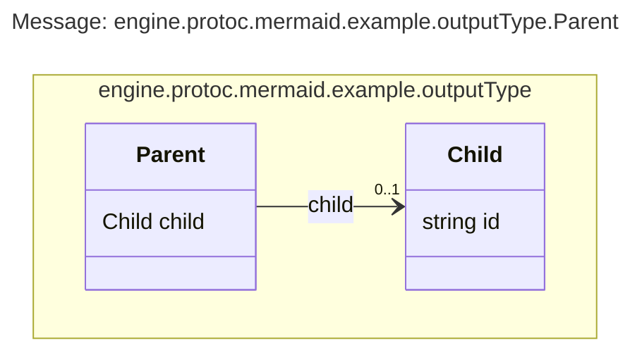

# Message: engine.protoc.mermaid.example.outputType.Parent

```mermaid
---
  title: "Message: engine.protoc.mermaid.example.outputType.Parent"
  config:
    class:
      hideEmptyMembersBox: true
      hierarchicalNamespaces: false
---
classDiagram
    namespace engine.protoc.mermaid.example.outputType {
        class Parent {
            Child child
        }

        class Child {
            string id
        }
    }

    Parent --> "0..1" Child : child
```
